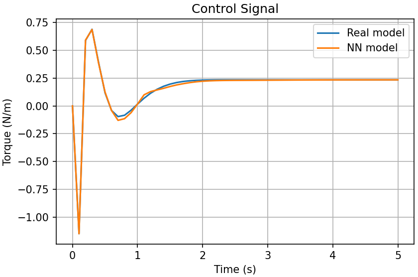

# Ball and Beam Model Identification Using Neural Network
This repository contains a simulation of the classic **Ball and Beam system**, a widely used benchmark in control system studies. The system models a ball rolling on a beam, where the beam's angle is controlled to achieve a desired ball position.

  

## Objective
The goal of the simulation is to training the model of **Ball and Beam System** using Neural Network. The trained model was controlled so that it stays at a specific distance from the center of the beam (setpoint tracking). The performance of real model and trained model was compared.

## Model Overview
The system states are:
- x₀: ball position (m)
- x₁: ball velocity (m/s)
- x₂: beam angle (rad)
- x₃: beam angular velocity (rad/s)

Neural network achitectures:
- Linear layer: 4
- Activation layer: 3
- Epoch: 100

## How To Run
Running the `main.py` script will automatically execute the full simulation and plot the results for comparison.
<table>
  <tr>
    <td align="center">
      
       Ball position and beam angle
    </td>
    <td align="center">
      
       Control signal
    </td>
  </tr>
</table>

You can easily modify:
- The desired ball position (setpoint)
- Initial conditions
- Controller parameters (desired pole) 

## Reference
For the model explaination, see [Virseda (2024)](https://www.google.com/url?sa=t&source=web&rct=j&opi=89978449&url=https://core.ac.uk/download/pdf/289940555.pdf&ved=2ahUKEwjlvZ3bjsmOAxXBd2wGHWyvD4sQFnoECBcQAQ&usg=AOvVaw2mHZUEjnCKbGnwOsch1QZt).
